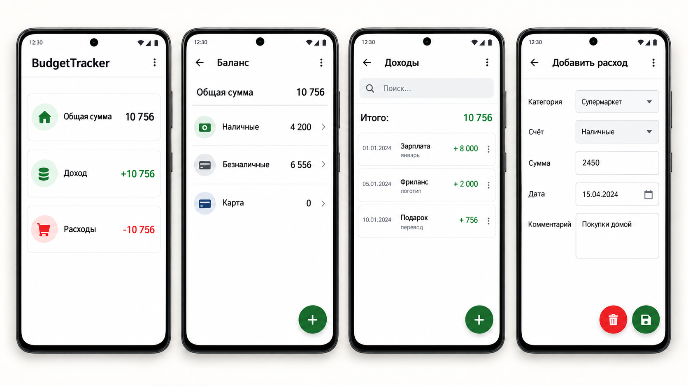

# BudgetTracker

Android-приложение для учета личных финансов и управления бюджетом.

Проект реализован на Kotlin и демонстрирует работу с локальным хранением данных, навигацией между экранами и dependency injection.

## Screenshots

<p align="center">
  
</p>
## Features

- просмотр общей суммы
- отдельный учет доходов и расходов
- управление счетами
- поиск по операциям
- добавление доходов
- добавление расходов
- выбор категории расхода
- выбор счета
- указание суммы, даты и комментария
- редактирование и удаление записей
- локальное хранение данных

## Tech Stack

- Kotlin
- Android SDK
- XML
- Room
- Hilt
- Navigation Component
- Safe Args
- ViewBinding
- RecyclerView
- Material Components

## Architecture

Приложение построено на нескольких Fragment-экранах и использует Navigation Component для переходов между ними.

Данные сохраняются локально с использованием Room.

Hilt используется для dependency injection.

## Main Screens

- Home — общая сумма, доходы и расходы
- Balance — список счетов
- Income — список доходов и поиск
- Expenses — список расходов и поиск
- Add Account — создание и редактирование счета
- Add Income — создание и редактирование дохода
- Add Expense — создание и редактирование расхода

## Project Structure

```text
app/
├── data/
├── di/
├── ui/
│   ├── balance/
│   ├── income/
│   ├── expences/
│   └── adddata/
├── MainActivity
└── App
